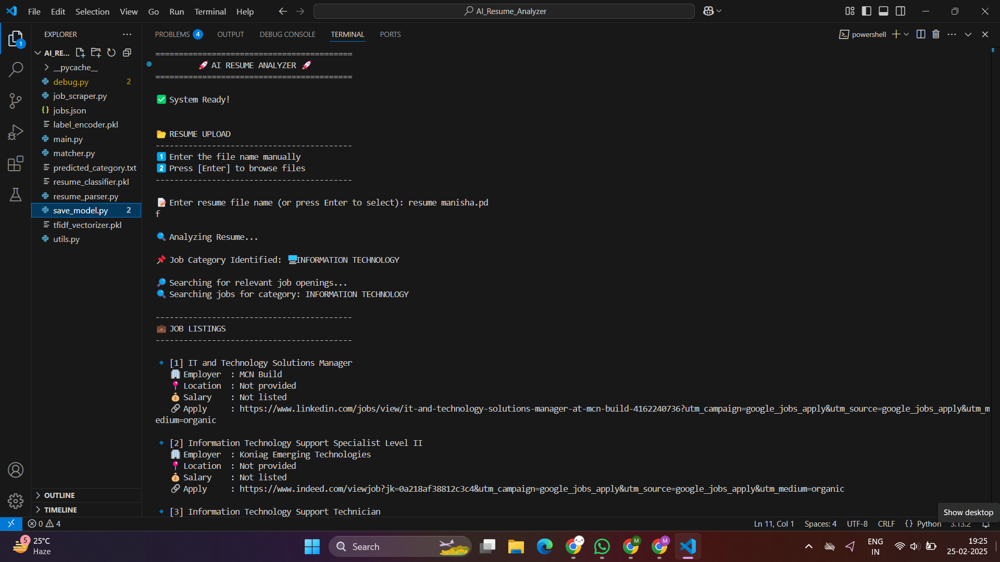

# AI-Powered Resume Job Matcher (CLI)

## Overview
The **AI-Powered Resume Job Matcher** is a command-line interface (CLI) application that intelligently analyzes resumes, classifies them into job categories, and fetches relevant job listings from an API. This tool helps job seekers find suitable job opportunities based on their resume content.

## Features
✅ **Resume Upload & Parsing** – Extracts text from resumes (PDF format).  
🤖 **AI-Based Resume Classification** – Uses **Random Forest** model to classify resumes into job categories.  
📊 **TF-IDF + NLP Processing** – Converts resume text into numerical features for better classification.  
📝 **Job Search & Matching** – Fetches relevant job listings using the predicted job category.  
📌 **Job Listing Display** – Provides paginated job listings with key details.  
🎯 **Error Handling & User-Friendly CLI** – Ensures smooth user experience with clear prompts and feedback.  

---

## Technologies Used
- **Python** – Core programming language
- **Scikit-Learn** – Machine Learning models ( Random Forest)
- **NLP (Natural Language Processing)** – Text vectorization using **TF-IDF**
- **pdfplumber** – Extracting text from PDF resumes
- **Pickle** – Model persistence for classification
- **Tkinter** – GUI for file browsing (optional)
- **Requests** – Fetching job listings via API

---

## Installation & Setup
### Prerequisites
Ensure you have **Python 3.7+** installed on your system. Verify it with:
```sh
python --version
```

### Clone the Repository
```sh
git clone https://github.com/yourusername/AI-Resume-Job-Matcher.git
cd AI-Resume-Job-Matcher
```

### Install Dependencies
```sh
pip install -r requirements.txt
```

---

## Usage Guide
### Step 1: Run the CLI Application
```sh
python main.py
```

### Step 2: Upload Resume
- Choose **manual file path entry** or **browse** to select a PDF.

### Step 3: Resume Processing
- The AI model extracts text, classifies the resume, and predicts the **job category**.

### Step 4: Fetch Job Listings
- The system queries an external API to fetch jobs matching the predicted category.
- Jobs are displayed in a **paginated** format for easy navigation.

### Example Output:
```
📂 Upload your resume (PDF)...
✅ Resume uploaded successfully!
🔍 Extracting text...
📌 Predicted Job Category: DATA SCIENCE

🔎 Fetching job listings...
💼 Job 1: Data Scientist
   🏢 Employer: ABC Corp
   📍 Location: New York, USA
   💰 Salary: Not listed
   🔗 Apply: [Job Link]
...
```

---

## Code Structure
📂 **resume_parser.py** – Handles resume uploads and extracts text from PDFs.  
📂 **matcher.py** – Uses Machine Learning models to classify resumes.  
📂 **job_scraper.py** – Fetches job listings from an external API.  
📂 **main.py** – Orchestrates the CLI flow, from upload to job search.  
📂 **models/** – Contains the pre-trained **Naïve Bayes** and **Random Forest** classifiers.  

---

## Future Enhancements
🌐 **Web-Based Interface** – Upgrade to a Flask/React-based web application.  
🤖 **AI-Powered Job Matching** – Implement deep learning for more accurate matching.  
📱 **Mobile App Version** – Extend the project for Android/iOS platforms.  

## Job Listings Output

Here is an example of the CLI displaying job listings after analyzing a resume:




